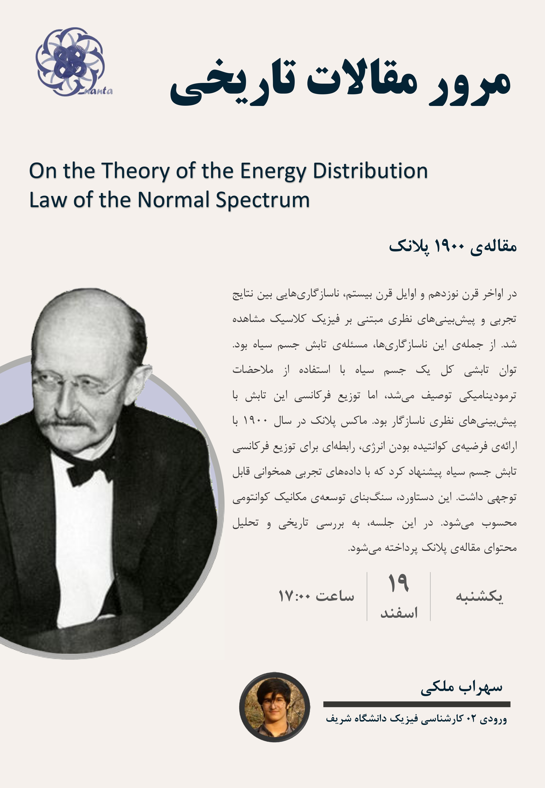

## Description
In the late 19th and early 20th centuries, discrepancies were observed between experimental results and theoretical predictions based on classical physics. Among these discrepancies was the problem of black-body radiation. The total radiative power of a black body was described using thermodynamic considerations, but the frequency distribution of this radiation was inconsistent with theoretical predictions. In 1900, Max Planck proposed a relationship for the frequency distribution of black-body radiation by introducing the hypothesis of quantized energy, which showed significant agreement with experimental data. This achievement is considered the foundation for the development of quantum mechanics. In this session, the historical context and content of Planck's paper will be examined and analyzed.

## Poster

## [Presentation pdf (English)](../../files/hp1-presentation.pdf)

### [Planck, 1900 - On an Improvement of Wien's Equation for the Spectrum](../../files/planck1900-1.pdf)
### [Planck, 1900 - On the Theory of the Energy Distribution Law of the Normal Spectrum](../../files/planck1900-2.pdf)

## Sources

[1] Max Planck, On an Improvement of Wien’s Equation for the Spectrum. University of Berlin, 1900.

[2] Max Planck, On the Theory of the Energy Distribution Law of the Normal Spectrum. University of Berlin, 1900.

[3] Jagdish Mehra & Helmut Rechenberg, The Historical Development of Quantum Theory, Vol. 1, Pt. 1

[4] Michael Fowler, Planck’s Route to the Black Body Radiation Formula and Quantization. University of Virginia.

[5] Michael Fowler, Black Body Radiation. University of Virginia.