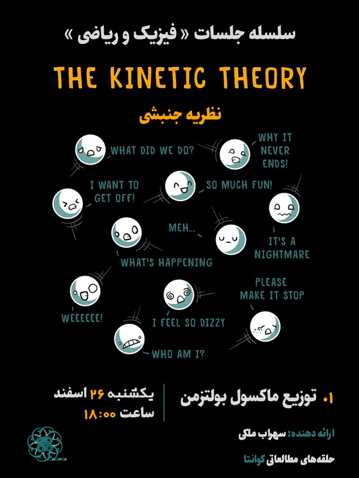

## Description
In this lecture, I investigate the elementary kinetic theory. I obtain the so-called Maxwell-Boltzmann distribution and then, delve into calculating cool properties of matter assuming thermal equilibrium.

## Poster

    

## [Presentation Board [pdf]]("../../files/kt1.pdf")

## Sources

[1] R. B. Singh, Thermal and Statistical Physics

[2] D. Tong, Lectures on Kinetic Theory.

[3] V. Karimipour, Lecture Notes on Thermodynamics and Statistical Physics.

