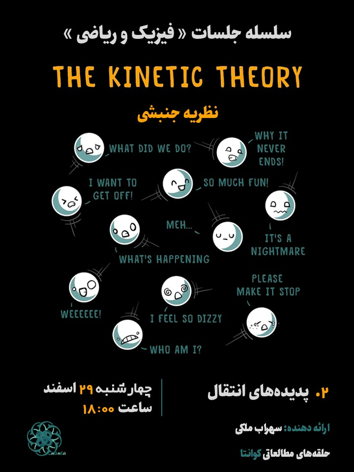

## Description
In this lecture, I investigate the Transport Phenomena. I begin with the Random Walk problem and consequently express the diffusion, fomulate the viscosity and finally, thermal conductivity using elementary kinetic theory methods.

## Poster

    

## [Presentation Board [pdf]]()

## Sources

[1] R. B. Singh, Thermal and Statistical Physics

[2] D. Tong, Lectures on Kinetic Theory.

[3] V. Karimipour, Lecture Notes on Thermodynamics and Statistical Physics.