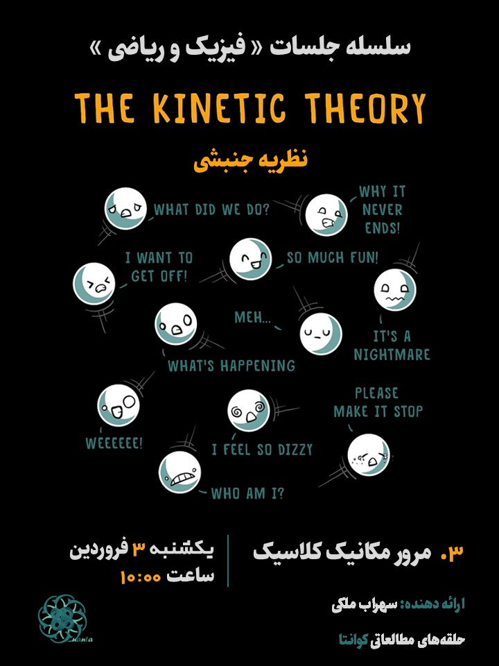

## Description
In this lecture, I review classical mechanics (and a bit of thermodynamics). This builds a comprehensive mathematical structure to beginning the treatment with the dynamics of many body systems (what we aim to reach in kinetic theory).

## Poster

    

## [Presentation Board [pdf]]()

## Sources

[1] D. Tong, Lectures on Classical Dynamics.

[2] V. Karimipour, Lecture Notes on Thermodynamics and Statistical Physics.

[3] L. D. Landau & E. M. Lifshitz, Course of Theoretical Physics: Vol. 1.

[4] J. V. José, Classical Dynamics: A Contemporary Approach.

[5] H. Goldstein, Classical Mechanics.